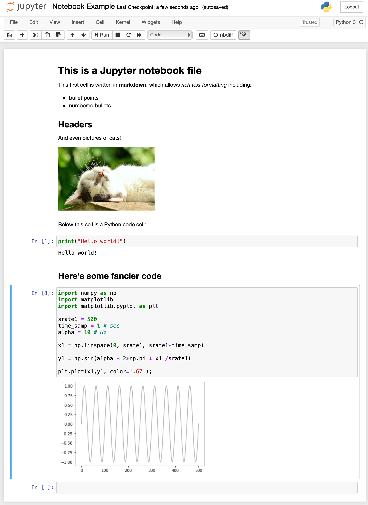

```{figure} images/jupyter_logo.svg
---
align: left
width: 65px
```
# Jupyter

[**Jupyter**](https://jupyter.org/) (pronounced like the planet, Jupiter) **notebooks** have revolutionized the practice of data science, and create an ideal environment for learning and communicating. A notebook is a file that contains a set of cells. Each cell can contain code; clicking on a code cell and then hitting its "run" button will execute the code. Any results (including graphics, formatted tables, or raw text) will be printed out right below the cell that generated them. Cells in a notebook are kind of a cross between a REPL in the terminal, and a file containing a set of commands that is saved and then run. Like a REPL, a Jupyter notebook cell will run the commands as soon as you run the cell, and print the output below the cell. However, cells can each contain many lines of code (like small program files), and a notebook can have many cells, each with bits of code. 

Moreover, notebooks are files that save both code and the output it generates. In contrast, conventional program files generate output that must be saved separately, for example in individual tables or image files. This can make it more difficult to keep track of what code generated what output --- the bane of many a scientist. Jupyter notebooks thus help support reproducibility and accountability in data science. 

Another great feature of notebooks is that cells can contain either code, or text formatted in a simple language called [**Markdown**](https://daringfireball.net/projects/markdown/). This means that in between your code cells, you can write blocks of text, for example to annotate or, essentially, "tell the  story" of your data. Indeed, you could literally write a scientific manuscript in a Jupyter Notebook, with the advantage that it contained all of the reproducible code used to perform the analysis. Indeed, this textbook is largely written in Jupyter notebooks! 


Here's an example screenshot of a notebook file:



Jupyter notebooks have a number of other great design features. For one, notebooks were designed to run through a web browser, which means that you can run, and store, your analyses on a remote server (e.g., one belonging to a lab or university), meaning that you don't have to worry about the storage, backups, or computational capabilities of the computer you're working on (I'm guessing for most of you, this is a not-super-powerful laptop). In fact, there are a number of online cloud services for running Jupyter notebooks that you can use for free, including [GitHub Codespaces](https://docs.github.com/en/codespaces), [Google Collaboratory](https://colab.research.google.com/notebooks/intro.ipynb#recent=true), and [CoCalc](https://cocalc.com/). Thus course uses GitHub Codespaces.

Another great feature of notebooks is that they can run code in a wide range of different languages. Indeed, the name "jupyter" comes from the names of the three first programming languages it supported: Julia, Python, and R. There are now over 100 different languages supported in Jupyter notebooks! Typically though, a given notebook file only runs a single language, so you have to pick when you first create the file.

In this class, you will work extensively in Jupyter notebooks, and you will use them to complete and submit your assignments and projects, as well. 
