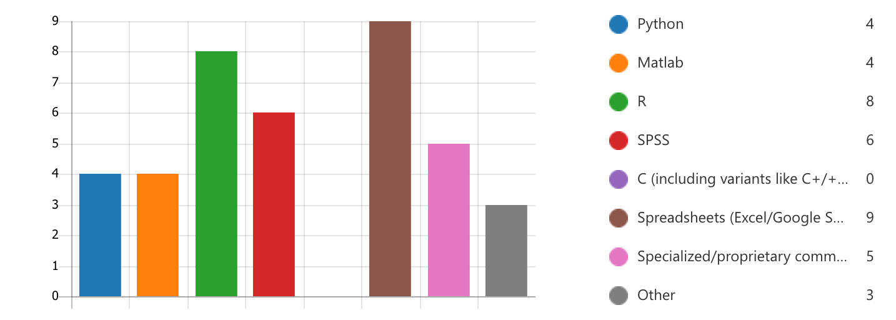

# Which language to use?

Although there are thousands of programming languages, a relatively small number of them are widely used. Which languages are the most popular or commonly-used depends on the discipline and area of use. Different languages are designed for very different purposes, and in many cases new work builds on older work, so the use of a particular language in a particular setting will tend to cause that language to propagate within that setting. For example, some languages are well-suited to building interactive web sites, while others may be more suitable for building apps for mobile devices, and others for writing code to be embedded in hardware devices.  

One of the most long-standing and representative indices of programming language popularity is the [TIOBE web site](https://www.tiobe.com/tiobe-index/), whose ratings are based on “the number of skilled engineers world-wide, courses and third party vendors. Popular search engines such as Google, Bing, Yahoo!, Wikipedia, Amazon, YouTube and Baidu are used to calculate the ratings.” Note that this is for priogramming in general, not data science specifically. As of August 29, 2023, the 10 most popular languages are (in order): Python, C, C++, Java, C#, JavaScript, Visual Basic, SQL, Assembly Language, and PHP. Don’t worry if you haven’t heard of all of these — there won’t be a test! This is merely to give you a sense of the “lay of the land”, and expose you to the names of languages you’re likely to come across in the future.

In data science, a few languages are particularly widely used. The internet is rife with clickbait-y pages such as “Top languages every data scientist should know in 202x”; while these may rely on questionable methodologies, a general survey of such pages reveals a fairly consistent set of languages, including Python, R, MATLAB, C, Java, SQL, Julia, and Scala. Within the field of neuroscience, however, the most common languages you’re likely to come across are Python, R, and MATLAB. Indeed, a  survey I conducted of faculty in the Department of Psychology & Neuroscience at Dalhousie University (April, 2020; n=11) supports this claim, as shown in the plot below (Note that SPSS is still widely used in statistics, but apparently far less in industrial data science applications).

It is important to know that there is no one, “best,” programming language — either for programming in general, or for neuroscience in particular. Indeed, many scientists have workflows that include multiple languages. For example, some of my own lab's research involves EEG neuroimaging. We rely on Python to process the EEG data, but R to perform the statistic. However, other EEG labs may use different workflows, such as MATLAB for processing and SPSS for statistics. My lab also does fMRI research; for this we have options that include point-and-click GUI-based (GUI = graphical user interface) software, or different packages written in MATLAB, Python, or R.

So the punch line is, you should use the language that is best-suited for the task at hand. In the example of my lab’s EEG workflow, we use Python for data processing because I prefer Python as a language to work in, and there is a robust and rapidly-growing EEG processing package (called [MNE](https://mne.tools)) that is written in Python. We use R for statistical analysis, however, because there are specific statistical approaches that I favour which either are not yet available in Python, or are less fully-featured in Python than the R versions. R was originally developed by and for statisticians, so it tends to have the most robust and well-developed versions of especially advanced or newer statistical approaches.
