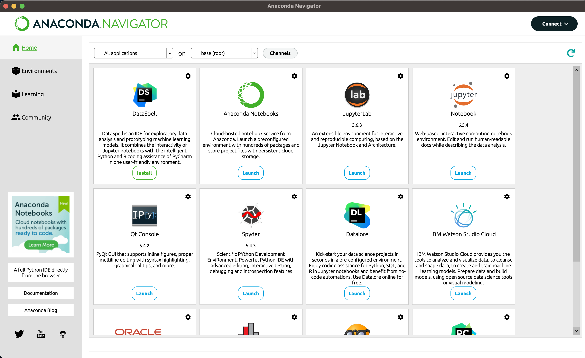

```{figure} images/anaconda.png
---
align: left
width: 65px
```
# Anaconda

There are a number of ways that you can install Python on your own computer. In fact, most modern operating systems come with some version of Python already installed --- however, you won't want to use that for this course. Instead, we will install the **Anaconda** software package. This is what is called a *distribution* of Python, meaning that it includes both the Python programming language, and also a number of other tools and libraries that are useful for data science. Anaconda also serves as a *package manager*, which makes it easy to install additional Python libraries that you will need, such as `MNE` for EEG analysis, and `nilearn` for MRI. Anaconda is available for Windows, Mac, and Linux, and is free to download and use from [Anaconda's website](https://www.anaconda.com/). You should download and run the installer for the latest version of Python 3, before reading any further. Note that you don't need to create an account with Anaconda, nor pay anything, to install and use it.

**Windows Users** can install Anaconda for "just me" or for all users on the computer. Either is fine, however if your user name has a space in it, you may get a warning about this. If you do, you should install Anaconda for all users. If you don't get a warning, you can install it for just you.

:::note}
Anaconda is the easiest way to get Python and all the libraries we need for this course. However, it is a large install --- the [system requirements](https://docs.anaconda.com/anaconda/install/) say you need 5 GB of space available on your hard drive. If you don't have this much space, you can install a smaller version of Anaconda called Miniconda, which is a minimal version of Anaconda that you can then add packages to as needed. The downside of installing Miniconda is that you will need to install key Python packages manually, using the command line. Instructions for doing this are provided [here](2b-setup/miniconda).
:::

## Running Anaconda
Once you have installed Anaconda on your computer, you should find the application and launch it (if it didn't start already at the end of the install). On Windows, you can find it in the Start menu, and on Mac, you can find it in the Applications folder. On Linux, you can launch it from the command line by typing `anaconda-navigator`. 

When you launch Anaconda, you should see a window that looks something like this:



This is the Anaconda **Navigator** panel. It is a graphical interface that allows you to launch the various applications that come with Anaconda. You're welcome to explore these tools, but we won't actually use them in the course; we'll use VS Code instead. Installing Anaconda is just the easiest way to get Python and all the libraries we need, and we can access these from within VS Code. So at this point, unless you want to explore the Navigator, you can quit the application.

## Updating Python
When you first install Anaconda, it will come with a specific version of Python, and a specific set of libraries. You can see which version of Python you have by clicking on the *Environments* tab of the Navigator. Anaconda installs a huge number of packages, which means it's easy to get started without worrying about what specific packages you need to install. When you first install Anaconda, you will have current versions of each package. Over the time you're in this course, it's unlikely that you will need to update any of the packages, you may want to in the future. If you do, you should do this from the Environments tab in Navigator.

One big advantage of using Anaconda to manage your Python installation and associated packages, is that Anaconda ensures that all of the packages you install are compatible with each other. Virtually all Python packages are under continual development, fixing bugs and adding features. Often one package will rely on code from another package, and if the second package changes, it may break the first package. Anaconda ensures that all the packages you install are compatible with each other, so you don't have to worry about this. 